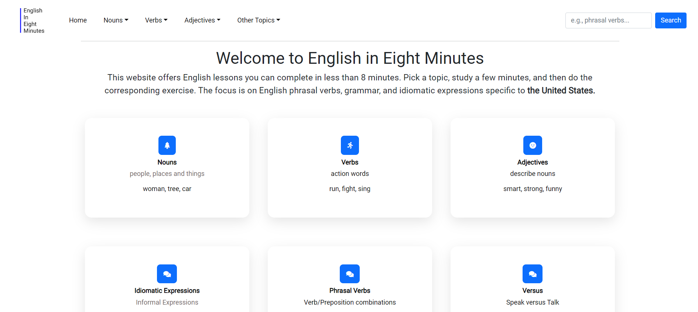

   An English grammar website, built for my students after a few of
   them started teaching me programming. I used react-router-dom for
   the routing and SASS for the styling. I also used Bootstrap to
   build the navbar and some tables.

## How To Run This Project

1. Clone project (in terminal add `git clone https://github.com/ChrisDietrich405/GC.Shop`)
2. Install dependencies (in terminal run `npm install`)
3. Run project (in terminal run `npm start`)

Open [http://localhost:3000](http://localhost:3000) to view it in the browser.

The page will reload if you make edits.\
You will also see any lint errors in the console.

## Screenshots
Home page

 
 
 

Grammar page

 
 
 

Grammar page

